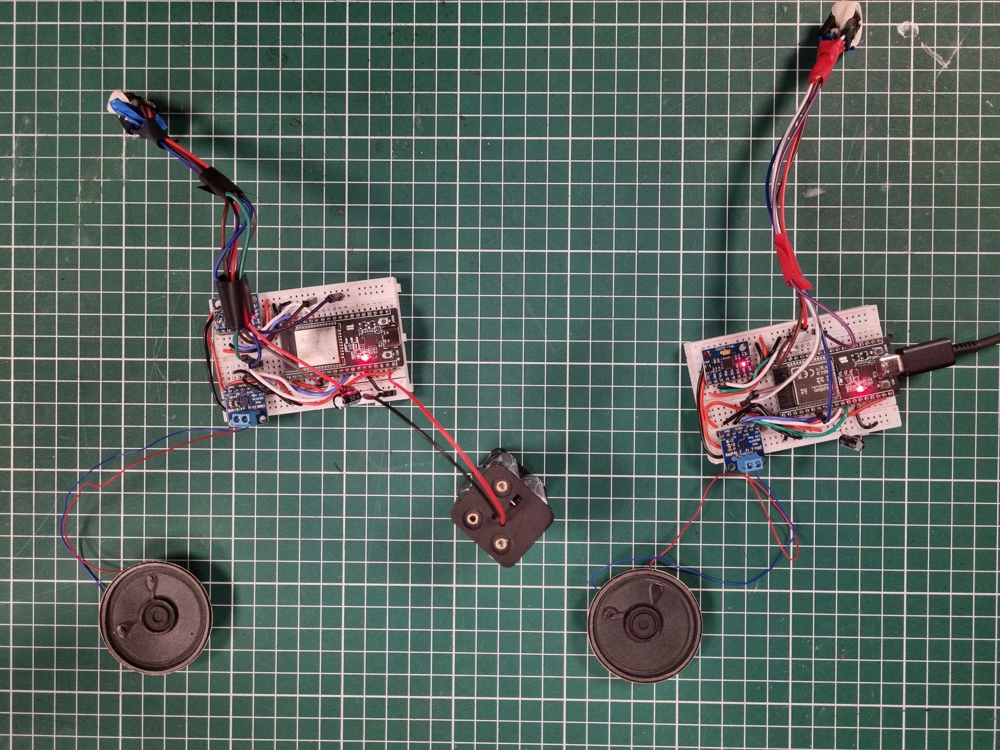
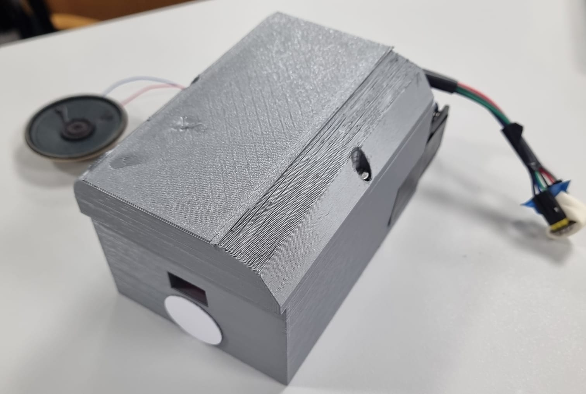
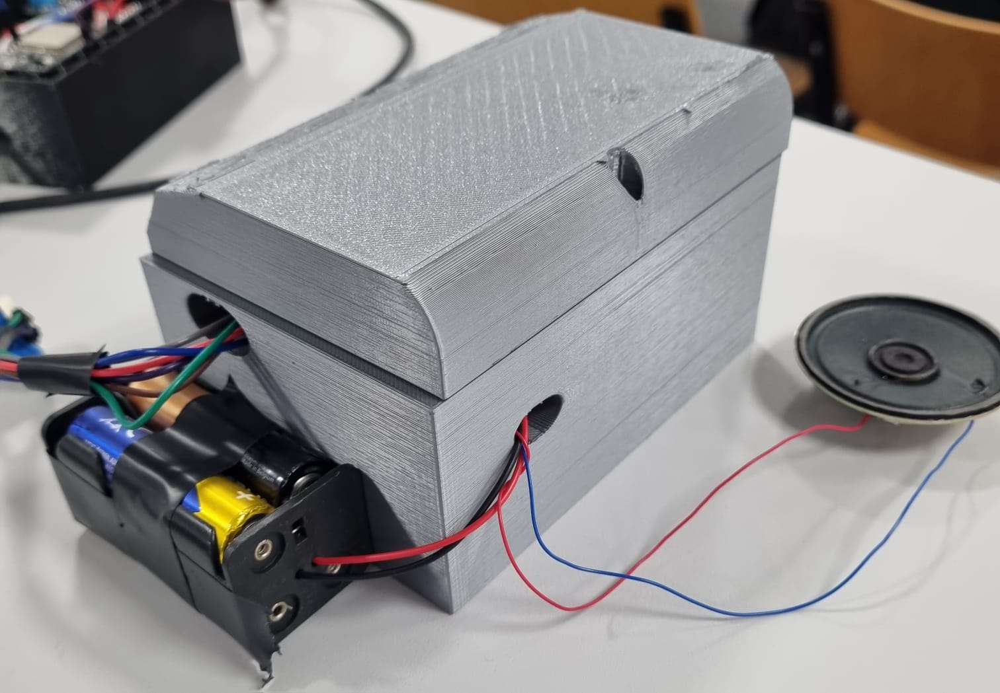
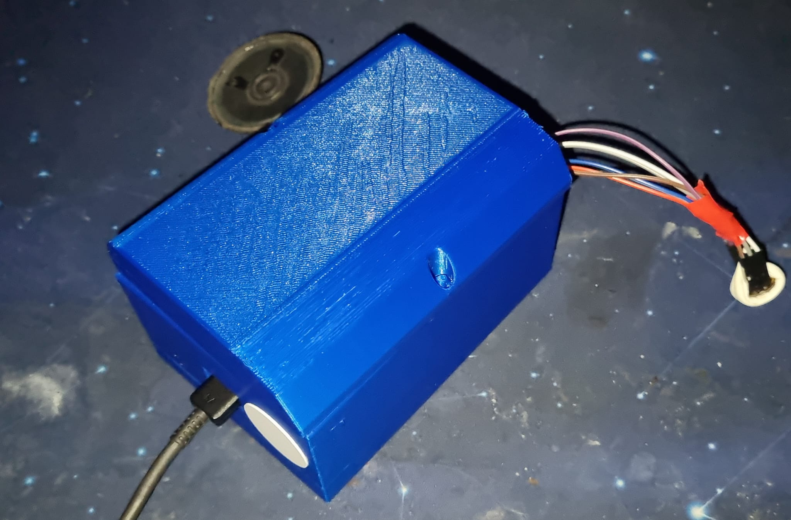

# Motorcycle_Intercom
**Smart Moto Intercom & Safety System**

## Description
This project focuses on creating a **Smart Intercom System for Motorcyclists** designed for decentralized communication and enhanced rider safety. The system uses an **ESP-NOW Mesh Network** to allow riders to communicate in remote areas without cellular or internet coverage.

Beyond communication, the device acts as a safety hub:
* **Crash Detection:** Uses an IMU to detect high-G impacts or unusual tilt angles.
* **Emergency SOS:** Automatically broadcasts GPS coordinates to the group mesh if a crash is detected.
* **NFC Medical ID:** A passive NFC tag stores vital data (blood type, allergies, ICE contacts) that can be scanned by first responders with any smartphone.

## Video
[See the circuit in action on YouTube](https://youtu.be/ce2_XN7YsI8)  

## Bill Of Materials (BOM)
- 2x ESP32
- 2x MPU6050 (Accelerometer + Gyroscope for Crash Detection)
- 2x NEO-6M GPS Module (Real-time Location Tracking)
- 2x NFC Tag NTAG215 (Passive Medical Data Storage)
- 2x INMP441 I2S Microphone (Audio Input)
- 2x MAX98357A I2S Amplifier
- 4x AA Batteries
- 2x 3D Printed Enclosure

## Tutorial source
- I don't plan to follow any tutorials. This is an original architectural design integrating decentralized networking with sensor fusion logic.

## Questions

### Q1 - What is the system boundary?
The system boundary is the physical intercom unit attached to the helmet. 
* **Inputs:** Voice signals, motion data (acceleration/rotation), and GPS coordinates.
* **Outputs:** Real-time audio to the rider, SOS data packets to the mesh network, and medical info via NFC.

### Q2 - Where does intelligence live?
Intelligence lives at the **Edge** on the ESP32. The MCU performs local data processing to detect crashes and manages the mesh routing logic without requiring an external server or cloud connection.

### Q3 - What is the hardest technical problem?
The most significant challenge is the **reliable transmission of data packets between the two devices in a Mesh network**. Maintaining low-latency audio while simultaneously handling high-priority emergency packets (SOS) in a dynamic, high-speed environment is technically demanding.

### Q4 - What is the minimum demo?
The minimum demo (MVP) will demonstrate the **successful connectivity between the two intercom devices**. This involves establishing a stable mesh link and verifying that a data packet (or alert) sent from one device is correctly received and processed by the second device.

### Q5 - Why is this not just a tutorial?
This project is an **original integration** of multiple complex systems: decentralized networking (Mesh), sensor fusion for safety (IMU/GPS), and emergency medical accessibility (NFC).

## Pin Map
The following table outlines the wiring configuration based on the 38-pin ESP32 DevKit:

| Component | Function | ESP32 GPIO Pins | Physical Pins |
| :--- | :--- | :--- | :--- |
| **I2S Audio** | BCLK / SCK | 14 | 12 |
| | WS / LRC | 27 | 11 |
| | Mic Data (SD) | 32 | 7 |
| | Amp Data (DIN) | 33 | 8 |
| **MPU6050** | I2C SDA | 21 | 33 |
| | I2C SCL | 22 | 36 |
| **Power** | 5V Input | VIN | 19 |
| | Common Ground | GND | 38 |

